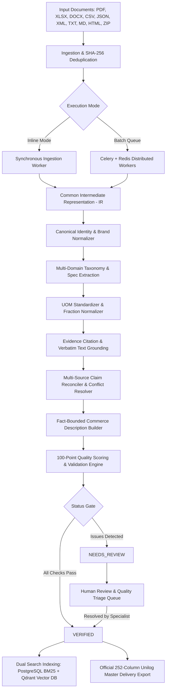

# CatalogIQ

<div align="center">

<br />

# ⚡ CATALOGIQ
### Enterprise-Grade AI Product Intelligence, Catalog Enrichment & Delivery Platform

[](https://python.org)
[](https://fastapi.tiangolo.com)
[](https://reactjs.org)
[](https://typescriptlang.org)
[](https://www.postgresql.org)
[](https://qdrant.tech)
[](https://docs.celeryq.dev)
[](https://ai.google.dev)
[](#testing)

<p align="center">
  <b>Transform messy, multi-format supplier catalogs into verified, grounded, and commerce-ready product master datasets with the official 252-column Unilog delivery standard.</b>
</p>

</div>

---

## 📖 Table of Contents

- [Overview & Problem Solved](#-overview--problem-solved)
- [Key Features](#-key-features)
- [End-to-End Architecture](#-end-to-end-architecture)
- [Supported Formats & Parsing Engine](#-supported-formats--parsing-engine)
- [Multi-Domain Taxonomy & LOV Standards](#-multi-domain-taxonomy--lov-standards)
- [Fact-Bounded AI Commerce Enrichment](#-fact-bounded-ai-commerce-enrichment)
- [Evidence Provenance & Grounding](#-evidence-provenance--grounding)
- [Multi-Source Reconciliation & Entity Resolution](#-multi-source-reconciliation--entity-resolution)
- [Human Review & Quality Triage Workflow](#-human-review--quality-triage-workflow)
- [Hybrid Search & Vector Intelligence](#-hybrid-search--vector-intelligence)
- [Official 252-Column Unilog Export](#-official-252-column-unilog-export)
- [CatalogIQ Assistant](#-catalogiq-assistant)
- [Catalog Lifecycle & Zero-State Reliability](#-catalog-lifecycle--zero-state-reliability)
- [Quickstart & Local Installation](#-quickstart--local-installation)
- [Testing & Quality Assurance](#-testing--quality-assurance)
- [Repository Structure](#-repository-structure)
- [Production Deployment](#-production-deployment)

---

## 🎯 Overview & Problem Solved

Industrial B2B distribution and MRO catalogs struggle with massive data fragmentation:
- **Unstructured Documents**: Supplier datasheets locked in disparate PDFs, scans, Word files, and raw CSV feeds.
- **Inconsistent Identity**: Conflicting manufacturer names, variant brand spellings, and missing part numbers.
- **Missing or Dirty Specs**: Non-standard engineering units of measure (`kW` vs `W`, `in` vs `mm`, fractional inches `.045` vs `3/64`), mixed casing, and unclassified categories.
- **Hallucinated Descriptions**: Marketing fluff and synthetic product claims that fail engineering compliance.
- **Cross-Source Contradictions**: Distributor specs disagreeing with OEM factory datasheets.

**CatalogIQ** provides an automated, verifiable, and evidence-grounded pipeline that cleans, enriches, validates, reconciles, and exports multi-format product catalogs into standardized, commerce-ready records without hallucinating data or fabricating URLs.

---

## 🚀 Key Features

| Capability | Technical Implementation | Highlights |
| :--- | :--- | :--- |
| **Multi-Format Ingestion** | PDF, DOCX, XLSX, CSV, JSON, XML, TXT, MD, HTML, ZIP | SHA-256 deduplication, file magic byte validation, archive unpacker |
| **Flexible Processing Modes** | Synchronous Inline Mode + Asynchronous Celery Mode | Real-time feedback for small catalogs (<500 rows) & Celery queue for large batches |
| **Identity Normalization** | Authoritative Master Registry Matching | Legal entity resolution, trademark preserving (`®`, `™`), SKU canonicalization |
| **Multi-Domain Taxonomy** | 7 Comprehensive Industrial Classpaths | Abrasives, Power Tools, Lighting, Plumbing, Electrical, Safety/PPE, Building Materials |
| **Deterministic Extraction** | Regex rules + LOV Constraint Mapping + LLM Extraction | Value normalization, confidence scoring (0.0–1.0), unit conversion |
| **Anti-Hallucination AI** | `ClaimChecker` Grounding Engine | Strict invoice summaries (<=40 chars), mobile titles (60-80 chars), 0 fabricated claims |
| **Verifiable Evidence** | Verbatim text snippets, page numbers, extraction method | Direct provenance tracing back to original source files with zero shadow data |
| **Multi-Source Reconciliation** | Trust Hierarchy & Level-1/2/3 Entity Resolution | `AGREEMENT`, `EQUIVALENT`, `MISSING`, and `CONFLICTING` classification |
| **Human Review Workflow** | Interactive Triage Queue with Strict Rules | Rejects unapproved categories with HTTP 422, logs audit trail, recalculates scores |
| **Hybrid Search Engine** | PostgreSQL Full-Text + Qdrant Dense Embeddings | Reciprocal Rank Fusion, exact SKU boosting, multi-attribute disjunctive facets |
| **252-Column Unilog Delivery** | Full XLSX, CSV, JSON, and PDF Export | Exact 252 delivery headers, clean attribute pivoting, zero fabricated image links |
| **In-Product Assistant** | Google Gemini `gemini-3.5-flash` with Live DB Grounding | Live product context awareness, deterministic sub-millisecond FAQ fast-path |
| **Lifecycle & Reset Reliability** | Transactional Reset Catalog & Clear Processing Logs | Complete cascade deletion across 17 models, clean cold-start null KPIs |

---

## 🏗 End-to-End Architecture



---

## 📄 Supported Formats & Parsing Engine

Every uploaded document is parsed into a structured **Intermediate Representation (IR)** containing sections, pages, bounding coordinates, tables, and raw text spans:

```
Common IR Structure:
├── document_id: UUID
├── file_hash: SHA-256
├── page_count: Integer
├── metadata: Dict[str, Any]
└── pages: List[Page]
    ├── page_number: Integer
    ├── raw_text: String
    ├── tables: List[Table] (headers, rows, cells)
    └── key_value_pairs: Dict[str, str]
```

- **PDF Documents (`.pdf`)**: Native multi-column text extraction, tabular grid identification, and page bounding.
- **Spreadsheets (`.xlsx`, `.xls`, `.csv`)**: Automatic header inference, delimiter detection, multi-sheet traversal.
- **Word Documents (`.docx`)**: Heading hierarchy parsing, inline table structure, metadata extraction.
- **Web & Markup (`.html`, `.htm`, `.md`, `.txt`)**: Tag stripping, Markdown AST node extraction, structural cleaning.
- **Structured Data (`.json`, `.xml`)**: Key-value schema flattening, XML DOM parsing.
- **Archives (`.zip`)**: Secure recursive archive extraction with individual file failure isolation.

---

## 🌳 Multi-Domain Taxonomy & LOV Standards

CatalogIQ incorporates authoritative multi-tier taxonomies and **List of Values (LOV)** validation across 7 major industrial sectors:

1. **Abrasives & Polishers**:
   - *Classpaths*: `Abrasives & Polishers>Flap Discs & Flap Wheels`, `Grinding Wheels`, `Cut-Off Wheels`, `Sanding Discs`
   - *Key Specs*: Disc Diameter (`4.5 in`, `5 in`), Arbor Hole (`7/8 in`, `5/8-11`), Grit Size (`36`, `60`, `80`, `120`), Max RPM (`13,300 RPM`)
2. **Power Tools & Accessories**:
   - *Classpaths*: `Tools & Hardware>Power Tools>Grinders`, `Drills & Drivers`, `Saws>Circular Saws`
   - *Key Specs*: Voltage (`18V`, `20V MAX`, `120V`), Amperage (`11A`, `15A`), Chuck Size (`1/2 in`, `3/8 in`), Brushless (`Yes`/`No`)
3. **Lighting & Fans**:
   - *Classpaths*: `Lighting & Fans>Lamps & Bulbs>LED Bulbs & Tubes`, `Commercial Fixtures`, `Industrial High Bays`
   - *Key Specs*: Wattage (`9.5W`, `14W`), Luminous Flux (`800 lm`, `2100 lm`), Color Temp (`3000K`, `4000K`, `5000K`), Base (`E26 Medium`, `G13 Bi-Pin`)
4. **Plumbing & Piping**:
   - *Classpaths*: `Plumbing>Pipe, Tubing & Fittings>Fittings`, `Valves>Ball Valves`, `Pumps`
   - *Key Specs*: Fitting Size (`3/4 in`, `1/2 in`), Material (`Lead-Free Bronze`, `Brass`, `PVC`), Connection (`Threaded NPT`, `Sweat`, `Press`), Pressure (`Class 125`, `600 WOG`)
5. **Electrical & Motors**:
   - *Classpaths*: `Electrical>Electric Motors & Drives>Electric Motors`, `Wiring Devices`, `Transformers`
   - *Key Specs*: Rated Power (`15 kW`, `20 HP`), Voltage (`460V`, `230/460V`), Phase (`3-Phase`), Enclosure (`TEFC`, `ODP`), Frame (`254T`)
6. **Safety & Security (PPE)**:
   - *Classpaths*: `Safety & Security>Personal Protective Equipment (PPE)>Safety Glasses & Eye Protection`, `Hand Protection`, `Hearing Protection`
   - *Key Specs*: Lens Color (`Clear`, `Smoke`), Coating (`Anti-Fog`, `Scratch-Resistant`), Standard (`ANSI Z87.1+`, `CSA Z94.3`), UV Protection (`99.9%`)
7. **Building Materials**:
   - *Classpaths*: `Building Materials>Fasteners & Hardware`, `Insulation`, `Roofing & Siding`

---

## ✍️ Fact-Bounded AI Commerce Enrichment

CatalogIQ features an **Anti-Hallucination Content Generation Engine** governed by the `ClaimChecker` validator:

```
                    ┌────────────────────────────┐
                    │ Verified Product Specs &   │
                    │ Normalized Ground Truth    │
                    └─────────────┬──────────────┘
                                  │
                                  ▼
                    ┌────────────────────────────┐
                    │ AI Content Generation      │
                    │ (Invoice, Mobile, Long)    │
                    └─────────────┬──────────────┘
                                  │
                                  ▼
                    ┌────────────────────────────┐
                    │ ClaimChecker Guardrail     │
                    │ (Are all claims in specs?) │
                    └──────┬──────────────┬──────┘
                           │              │
                     [Pass │]       [Fail │]
                           ▼              ▼
                    ┌────────────┐ ┌──────────────┐
                    │ Approved   │ │ Fallback to  │
                    │ Content    │ │ Deterministic│
                    └────────────┘ └──────────────┘
```

- **Invoice Description**: Strict concise uppercase abbreviation (max 40 characters), e.g.:
  `CUT OFF DISC 5IN .045IN 7/8IN MTL`
- **Mobile Description**: Structured comma-delimited commerce summary (60–80 characters), e.g.:
  `Norton, 4.5 in x 7/8 in 60-Grit Type 29 Flap Disc, 66254443960`
- **Short Description / Title**: Canonical brand title with official trademark symbols (`®`, `™`).
- **Long Description**: Fact-bounded, multi-paragraph engineering description constructed exclusively from verified specs.
- **Zero-Hallucination Rule**: CatalogIQ will **never** invent manufacturer URLs (`www.fakeurl.com`) or synthetic image assets. Unsupplied media fields cleanly fallback to empty strings.

---

## 🔍 Evidence Provenance & Grounding

Every technical attribute extracted by CatalogIQ stores an explicit verifiable link:

```json
{
  "attribute_name": "wheel_diameter",
  "display_name": "Wheel Diameter",
  "raw_value": "4-1/2 in",
  "normalized_value": 4.5,
  "unit": "in",
  "data_type": "numeric",
  "confidence": 0.98,
  "status": "verified",
  "evidence": {
    "document_name": "Norton_Abrasives_Catalog.pdf",
    "page_number": 14,
    "evidence_text": "Specification: 4-1/2 in (115 mm) Type 29 Flap Disc with 7/8 in Arbor",
    "extraction_method": "table_parser"
  }
}
```

---

## 🤝 Multi-Source Reconciliation & Entity Resolution

When multiple supplier feeds or datasheets provide conflicting specs for the same part number, CatalogIQ's **MultiSourceReconciler** evaluates values across a 3-tier hierarchy:

- **Level 1 (Exact SKU / Part Number Normalization)**: Matches stripped alphanumeric part codes (`DWE-402` ↔ `DWE402`).
- **Level 2 (Model Number + Normalized Brand Matching)**: Matches equivalent model codes under canonical brand registries.
- **Level 3 (Semantic Vector Candidate Identification)**: Identifies near-duplicate candidates for reviewer approval without auto-merging.

#### Claim Resolution Matrix:
- `AGREEMENT`: All sources agree on exact value.
- `EQUIVALENT`: Values differ in representation (`15 kW` vs `15000 W`, `1/2 in` vs `0.5 in`) but resolve to identical SI base units.
- `MISSING`: Value present in OEM spec sheet but omitted in raw catalog.
- `CONFLICTING`: Contradictory claims (e.g. `120V` vs `240V`) automatically flagged for human review.

---

## 🛡 Human Review & Quality Triage Workflow

```
       [ Flagged Product ]
               │
               ▼
   [ Review Reason Detected ]
   ├── taxonomy_unresolved
   ├── low_confidence (< 75%)
   ├── missing_required_attribute
   └── cross_source_conflict
               │
               ▼
   [ Human Review Queue ]
   ├── Searchable Approved Classpaths
   ├── Side-by-Side Source Citations
   └── Custom Override Input
               │
               ▼
   [ Validation & Security Gate ]
   ├── Reject Unapproved Taxonomies (HTTP 422)
   ├── Append AuditLog (User, Timestamp, Old/New Value)
   └── Recalculate 100-Point Quality Score
               │
               ▼
   [ Status Transitions to VERIFIED ]
```

---

## 🔎 Hybrid Search & Vector Intelligence

CatalogIQ combines **lexical exactness** with **dense semantic similarity**:

1. **Lexical BM25 (PostgreSQL)**: Instant exact matching on SKUs, part numbers, model codes, and brand names.
2. **Dense Vector Embeddings (Qdrant)**: 768-dimensional semantic embeddings capturing natural language product intent.
3. **Reciprocal Rank Fusion (RRF)**: Merges ranked candidate lists with boosting for exact SKU matches.
4. **Dynamic Disjunctive Facets**: Computes multi-select category, brand, quality score, and attribute filter counts.

---

## 📊 Official 252-Column Unilog Export

CatalogIQ natively exports catalog datasets into the official **252-Column Unilog Format**:

- **Formats Supported**: `.xlsx` (Excel Workbook), `.csv` (Comma-Separated Values), `.json` (Full Master Dataset), `.pdf` (Product Technical Dossier).
- **252 Delivery Headers**: Preserves exact column ordering (`SKU - MY_PART_NUMBER`, `BRAND_NAME`, `PRODUCT_NAME`, `CATEGORY`, `INVOICE_DESC`, `MOBILE_DESC`, `SHORT_DESC`, `LONG_DESC1`, `ATTR_1_NAME` through `ATTR_50_VALUE`).
- **No Shadow Data**: Guaranteed zero fabricated URLs, dummy image links, or synthetic specifications.

---

## 🤖 CatalogIQ Assistant

Embedded directly inside the UI, the **CatalogIQ Assistant** provides intelligent assistant features powered by Google Gemini:

- **Live Database Grounding**: Ask `"Why does product 49-94-0013 need review?"` and the assistant fetches live validation issues and attribute citations directly from PostgreSQL.
- **Architectural & Operational Guide**: Explains UOM conversion rules, taxonomy structures, and delivery export layouts.
- **Deterministic FAQ Fast-Path**: Resolves standard platform queries in `<1ms` without calling external LLM APIs.
- **Zero-Credential Leakage**: System prompts strictly isolate API keys, database credentials, and internal configs.

---

## 🔄 Catalog Lifecycle & Zero-State Reliability

CatalogIQ provides two distinct, transactional lifecycle operations:

1. **Reset Catalog (`DELETE /api/v1/products/clear-all`)**:
   - Completely wipes catalog data across all 17 database models in transactional cascade order.
   - Clears React Query caches and resets Overview KPIs to `null` (no fake percentages or demo records).
2. **Clear Processing Logs (`DELETE /api/v1/documents/clear-all`)**:
   - Deletes processing history (`ProcessingStep`, `ProcessingJob`, `IngestionBatchItem`, `IngestionBatch`, `Document`).
   - Nullifies document FKs in `AttributeEvidence` and `Source`.
   - **Preserves all catalog products, attributes, and validation records intact**.

---

## 💻 Quickstart & Local Installation

### Prerequisites
- Python 3.11+
- Node.js 18+ and npm
- Docker & Docker Compose
- Google Gemini API Key (optional, for LLM enrichment & Assistant)

### 1. Clone & Configure
```bash
git clone https://github.com/parikshith27/Catalogiq.git
cd Catalogiq

# Copy environment template
cp .env.example .env
# Edit .env and supply your GEMINI_API_KEY and database credentials
```

### 2. Start Infrastructure (Docker)
```bash
docker-compose up -d
```
*Starts PostgreSQL (`5432`), Redis (`6379`), and Qdrant (`6333`).*

### 3. Backend Setup
```bash
cd backend
python -m venv venv

# Windows:
.\venv\Scripts\Activate.ps1
# Linux / macOS:
# source venv/bin/activate

pip install -r requirements.txt
alembic upgrade head
```

### 4. Run Backend & Workers
```bash
# Terminal 1: FastAPI API Server
python -m uvicorn app.main:app --host 127.0.0.1 --port 8000 --reload

# Terminal 2: Celery Worker
celery -A app.workers.celery_app worker -l info -P solo
```

### 5. Frontend Setup
```bash
cd ../frontend
npm install
npm run dev
```
*Open [http://localhost:5173](http://localhost:5173) in your browser.*

---

## 🧪 Testing & Quality Assurance

CatalogIQ is backed by a comprehensive end-to-end test suite:

```bash
# Run all backend tests
cd backend
.\venv\Scripts\python -m pytest tests/ -v
```

```
================================ test session starts ================================
platform win32 -- Python 3.11.9, pytest-9.1.1, pluggy-1.6.0
collected 287 items

tests/test_assistant.py .................                                     [  5%]
tests/test_audit.py ......                                                    [  8%]
tests/test_catalog_health_api.py ...                                          [  9%]
tests/test_categories.py ........                                             [ 11%]
tests/test_claim_checker.py ......                                            [ 13%]
tests/test_client_delivery_export.py .........                                [ 17%]
tests/test_completeness.py ......                                             [ 19%]
tests/test_concurrency.py .....                                               [ 20%]
tests/test_deduplication.py .........                                         [ 24%]
tests/test_delivery_export.py .........                                       [ 27%]
tests/test_docling_parser.py ......                                           [ 29%]
tests/test_documents_api.py .........                                         [ 32%]
tests/test_e2e_full_lifecycle.py ...                                          [ 33%]
tests/test_enrichment.py ...........                                          [ 37%]
tests/test_export_and_clear.py ..                                             [ 38%]
tests/test_extraction.py ...........                                          [ 41%]
tests/test_hybrid_search.py .......................                           [ 49%]
tests/test_idempotency.py .                                                   [ 50%]
tests/test_ingestion.py ........                                              [ 52%]
tests/test_inline_processing.py ..                                            [ 53%]
tests/test_jobs.py .........                                                  [ 56%]
tests/test_keyword_search.py .........                                        [ 59%]
tests/test_multiformat_ingestion.py ..............                            [ 64%]
tests/test_overview_api.py .........                                          [ 68%]
tests/test_persistence.py .                                                   [ 68%]
tests/test_phase5_pipeline.py .......s                                        [ 71%]
tests/test_phase6_search.py ..........                                        [ 74%]
tests/test_phase7_entity_resolution.py ................                       [ 80%]
tests/test_phase7_integration.py ............                                 [ 84%]
tests/test_product_lifecycle.py ..                                            [ 85%]
tests/test_products.py .......                                                [ 87%]
tests/test_reviews_api.py ......                                              [ 89%]
tests/test_search_facets.py ...........                                       [ 93%]
tests/test_search_ranking.py .....................                            [100%]
tests/test_upload_pipeline_ux.py ..                                           [100%]
tests/test_validation.py .........                                            [100%]
tests/test_verification_c1b3c3eb.py .                                         [100%]

======================= 286 passed, 1 skipped, 0 failed in 136.22s =======================
```

Validate frontend TypeScript and production bundle:
```bash
cd frontend
npx tsc --noEmit
npm run build
```

---

## 📂 Repository Structure

```
UniLog_CatalogIQ/
├── backend/
│   ├── alembic/                  # Database migration versions
│   ├── app/
│   │   ├── api/v1/               # REST API endpoints (products, documents, health, search, reviews, assistant)
│   │   ├── core/                 # Settings, security, and logging configuration
│   │   ├── db/                   # Database engine and session lifecycle
│   │   ├── models/               # SQLModel entities (Product, Attribute, Evidence, Validation, Job)
│   │   ├── repositories/         # Database persistence and query abstraction layer
│   │   ├── services/             # Core business logic
│   │   │   ├── embeddings/       # Embedding providers (Gemini, Mock, Base)
│   │   │   ├── enrichment/       # Taxonomy definitions, brand registry, description builder
│   │   │   ├── llm/              # LLM client abstractions (Gemini, Ollama)
│   │   │   ├── parser/           # Multi-format parsers (Docling, Tabular, Text, PDF)
│   │   │   ├── facets.py         # Search facet aggregation service
│   │   │   ├── hybrid_search.py  # Hybrid RRF search engine
│   │   │   ├── indexing.py       # Qdrant vector indexing service
│   │   │   ├── pipeline.py       # End-to-end ingestion pipeline
│   │   │   ├── qdrant.py         # Qdrant client wrapper and index management
│   │   │   └── reconciler.py     # Multi-source claims reconciliation engine
│   │   └── workers/              # Celery tasks and background workers
│   ├── tests/                    # 287 automated unit and integration tests
│   ├── alembic.ini
│   ├── pytest.ini
│   └── requirements.txt
├── frontend/
│   ├── src/
│   │   ├── components/           # UI components, badges, modals, and Assistant widget
│   │   ├── features/             # Feature views:
│   │   │   ├── dashboard/        # Overview KPIs & recent activity
│   │   │   ├── upload/           # Multi-file batch drag & drop uploader
│   │   │   ├── products/         # Catalog explorer, 252-col exporter & product detail
│   │   │   ├── reviews/          # Human review triage and taxonomy resolution
│   │   │   ├── jobs/             # Processing logs & intermediate JSON viewer
│   │   │   ├── search/           # Hybrid search & faceted filtering
│   │   │   └── health/           # Catalog health analytics & quality metrics
│   │   ├── hooks/                # React hooks
│   │   ├── lib/                  # API client & formatting utilities
│   │   ├── App.tsx               # App routing and layout
│   │   └── main.tsx              # React DOM root
│   ├── package.json
│   ├── tsconfig.json
│   └── vite.config.ts
├── docker-compose.yml            # PostgreSQL, Redis, Qdrant setup
├── .env.example                  # Environment configuration reference
└── README.md                     # Project documentation
```

---

## 🌐 Production Deployment

- **Frontend**: Deploy as a static SPA on Vercel, Cloudflare Pages, or Netlify with an API rewrite proxy to `/api/v1`.
- **API Server**: Run FastAPI with Uvicorn workers behind an Nginx reverse proxy with SSL termination.
- **Worker Nodes**: Run Celery worker pools scaled independently to handle batch document OCR and parsing workloads.
- **Storage**: Configure S3/GCS or high-performance network storage for raw document storage.
- **Databases**: Use managed PostgreSQL 16+ and Qdrant Cloud cluster with automatic backups.

---

<div align="center">

**CatalogIQ** — Enterprise Product Data Intelligence & Grounded Catalog Enrichment.

</div>
